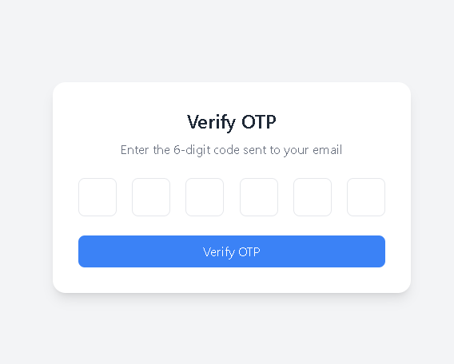
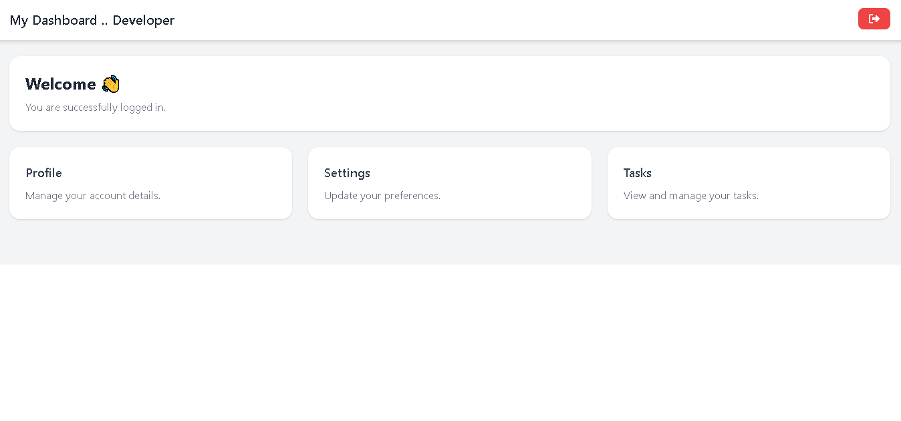

# OTP Authentication System 🔐

A full-stack authentication application built with Angular and Node.js.

The application allows users to register, verify their account using a One-Time Password (OTP) sent via email, and securely access a protected dashboard after login.

---

## 🚀 Features

* User Registration
* Email Verification with OTP
* Login Authentication
* JWT Authentication
* Protected Routes
* Angular Route Guards
* Dashboard Access after Login
* Responsive Design
* Nodemailer Email Integration
* Environment Variables Configuration

---

## 🏗️ Project Structure

```text
OTP-Authentication-System/
├── frontend/
├── backend/
├── screenshots/
└── README.md
```

---

## ⚙️ Tech Stack

### Frontend

* Angular
* TypeScript
* RxJS
* Angular Forms
* Angular Router

### Backend

* Node.js
* Express.js
* MongoDB
* JWT
* Nodemailer

---

## 📸 Screenshots

### Registration Page


### OTP Verification



### Login Page


### Dashboard



---

## 🔄 User Flow

1. User registers an account.
2. OTP is sent to the user's email.
3. User verifies the OTP.
4. User is redirected to the Login page.
5. User logs in successfully.
6. User accesses the protected Dashboard.

---

## 🚀 Installation

### Frontend

```bash
cd frontend
npm install
ng serve
```

### Backend

```bash
cd backend
npm install
npm run dev
```

---

## 👨‍💻 Author

Developer Maher